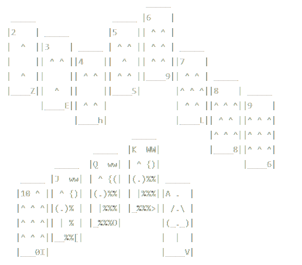
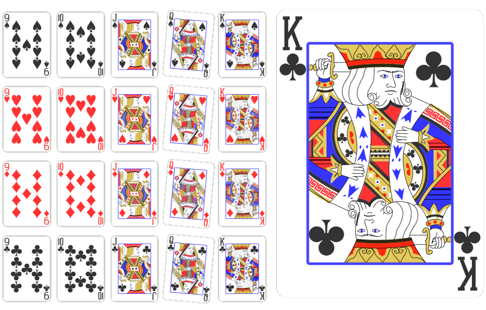

    <h1>
        Playing Cards
    </h2>

    

        Repository unites multiple grafics for playing Cards for games like Poker or BlackJack and is meant to be used as Dependency.
    

    

        
    

     
    

        
    

    <h2>
        Sources
    </h2>
    <h3>
        ASCII
    </h3>
        <a href="./src/logo.txt">
            Logo
        </a> 
         
        <a href="./src/symbols1.txt">
            Symbols 1
        </a> 
         
        <a href="./src/ver1.txt">
            Ver 1
        </a> 
         
        <a href="./src/ver2.txt">
            Ver 2
        </a>
    <h3>
        Images
    </h3>
        <a href="https://github.com/cardmeister/cardmeister.github.io/">
            CardMeister
        </a> 
         

